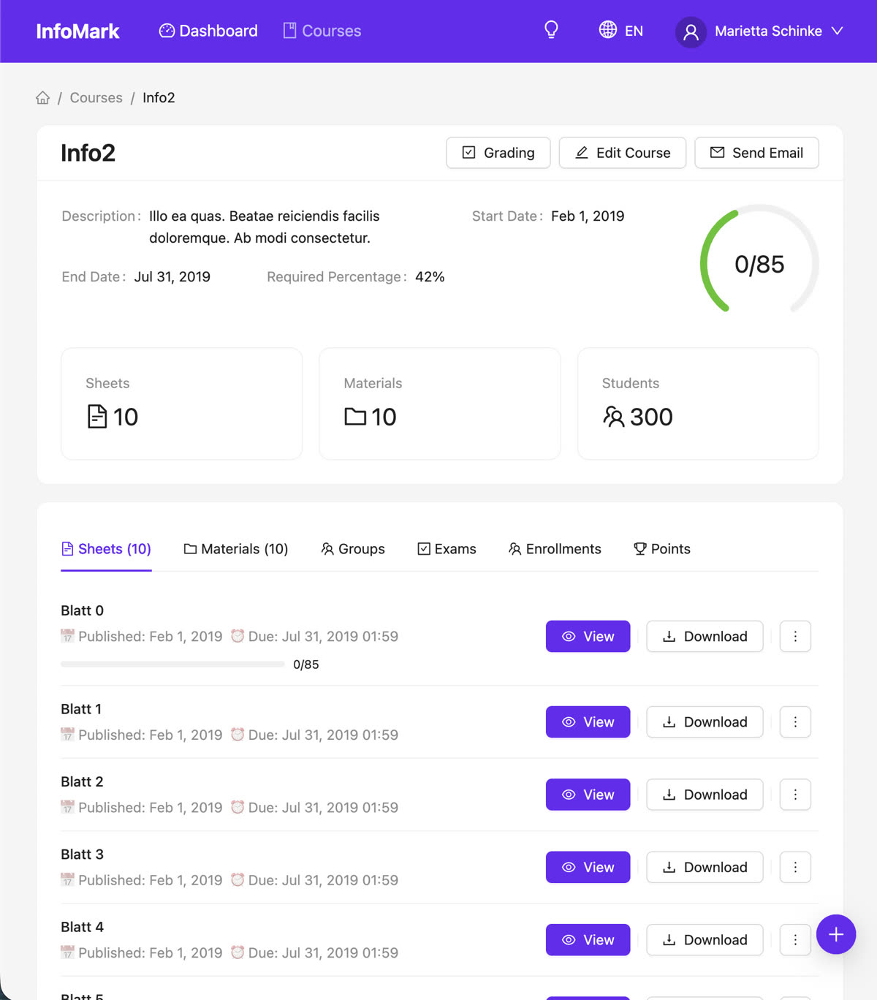
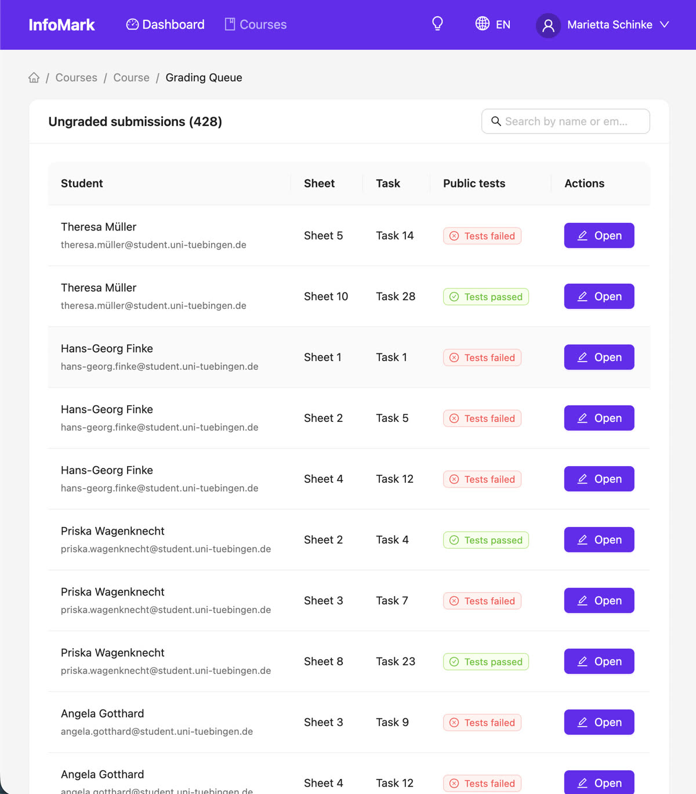
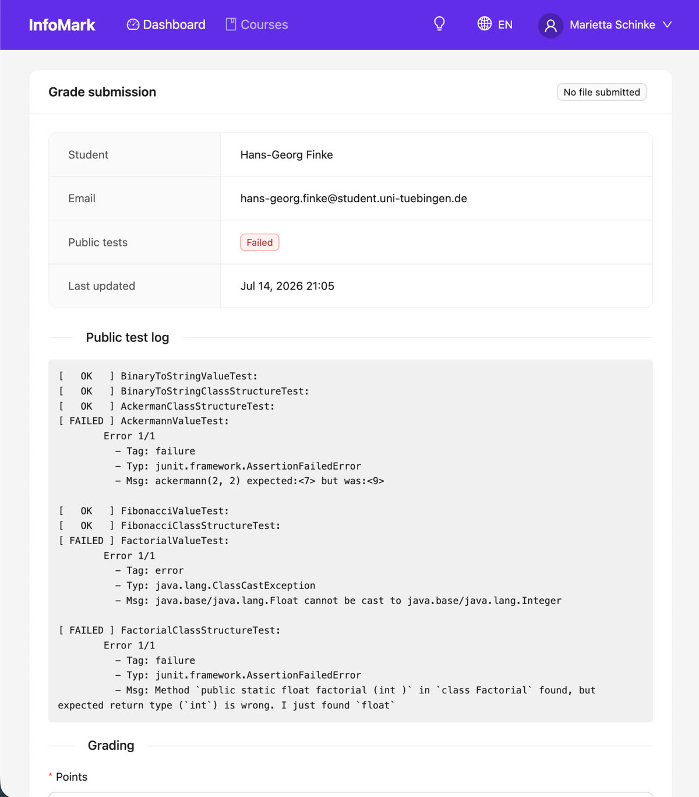

# InfoMark

InfoMark is a scalable, modern and open-source online course management
system with automatic testing and grading of programming assignments.
Students upload their solutions, InfoMark runs the course's unit tests
against every submission inside isolated Docker containers, and tutors
grade with the test results already at hand — easing the repetitive part
of teaching assistant work.

This repository is the canonical home of the project and contains the
complete system: the Go REST backend, the React web UI, and the
background worker that executes submission tests.

## Screenshots

| Course overview | Grading queue | Grading a submission |
|---|---|---|
|  |  |  |

## Features

- Course management: exercise sheets, tasks, materials, exams, and
  exercise groups with student bidding.
- Automatic testing of student submissions via per-task unit tests
  executed in Docker containers, with public results visible to
  students and private results reserved for graders.
- Grading workflow for tutors: a queue of ungraded submissions with
  test outcomes, points, and written feedback.
- Role-based access (student, tutor, course admin, site root) enforced
  server-side on every route.
- Web UI in English and German with light and dark mode.
- Single-binary deployment: the compiled React UI is embedded into the
  Go binary, which serves both the UI and the REST API under `/api/v1`.

## Architecture

- `api/` — chi-based REST backend (sessions + JWT auth, rate limiting,
  Prometheus metrics).
- `ui/` — React 19 + TypeScript + Ant Design single-page app, built
  with [Bun](https://bun.sh) and Vite.
- `service/` — AMQP producer/consumer pair; the worker runs submission
  tests in memory-limited, network-less Docker containers.
- `database/`, `migration/` — PostgreSQL store and schema migrations
  (embedded in the binary, applied via the console command).
- Backing services: PostgreSQL, Redis (rate limiter), RabbitMQ (test
  job queue).

## Quickstart

```bash
# Build the UI and the server binary.
cd ui && bun install && bun run build:embed && cd ..
go build -o infomark .

# Generate a configuration and a docker-compose file for the backing
# services, then start them.
./infomark console configuration create > infomark-config.yml
./infomark console configuration create-compose infomark-config.yml > docker-compose.yml
docker compose up -d

# Create the database schema and start the server.
export INFOMARK_CONFIG_FILE=`realpath infomark-config.yml`
./infomark console database migrate
./infomark serve
```

The server now serves the UI and API on the configured port (2020 by
default). Create the first admin account via the sign-up page and the
console user management commands (`./infomark console user --help`).

## Development

### Testing

Run once

```bash
go build -o infomark .
./infomark console configuration create > infomark-test-config.yml
./infomark console configuration create-compose infomark-test-config.yml > docker-compose.yml
# The generated config disables email verification and allows 100
# requests per minute, but the test suite expects CI semantics:
# set authentication.email.verify to true and
# authentication.total_requests_per_minute to 10 in infomark-test-config.yml.

# Test run against an actual database and redis.
sudo docker-compose up -d

# Create the database schema.
export INFOMARK_CONFIG_FILE=`realpath infomark-test-config.yml`
./infomark console database migrate

# We mock some data to test against.
cd migration/mock
pip3 install -r requirements.txt
python3 mock.py
sudo apt install postgresql-client
PGPASSWORD=... psql -h 'localhost' -U 'database_user' -d 'infomark' -f mock.sql >/dev/null
cd ../../
```

Tests can run multiple-times as we rollback all changes to the database.
The redis-backed rate limiter keeps its counters between runs, so flush
redis before each run or the login rate-limit test will produce spurious
429 failures:

```bash
redis-cli flushall  # or: docker exec <redis-container> redis-cli flushall
export INFOMARK_CONFIG_FILE=`realpath infomark-test-config.yml`
go test ./... -cover -v --goblin.timeout 15s -coverprofile coverage.out
```

### Building

The React UI lives in `ui/` and is compiled into the `static/` folder,
which the Go binary embeds at compile time via `go:embed`. Build the UI
first, then the server:

```bash
cd ui
bun install
bun run build:embed   # typechecks, builds, and writes to ../static
cd ..
go build -o infomark .
```

The resulting binary serves the UI at the site root and the API under
`/api/v1`. For UI development use `bun run dev` in `ui/`, which starts a
dev server on port 3000 that proxies `/api` to a locally running backend
on port 2020.

## History

InfoMark was originally developed at the University of Tübingen and is a
[rewrite of the first implementation](https://github.com/infomark-org/InfoMark-deprecated).
It has been used in production courses with hundreds of students.

## License

GPL-3.0 — see [LICENSE](LICENSE).
